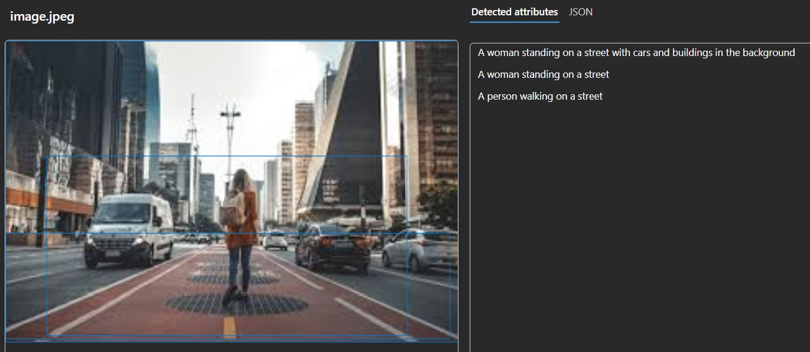
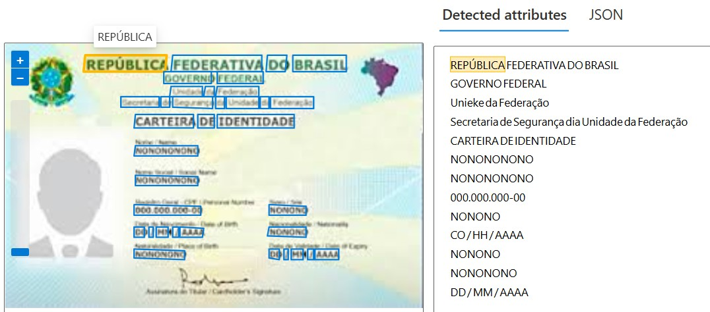
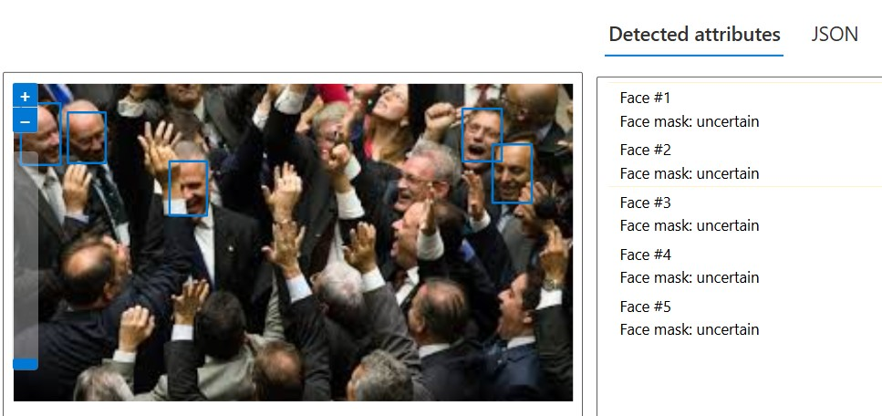

# Reconhecimento de Imagens com IA da Azure

Este repositório contém um projeto prático desenvolvido durante o curso de Inteligência Artificial da Azure na DIO. O objetivo deste projeto é explorar e aplicar conceitos de reconhecimento de imagens, incluindo OCR (Reconhecimento Óptico de Caracteres), detecção de rostos e análise de imagens.

## 📌 Estrutura do Projeto

📂 `inputs/` - Contém as imagens utilizadas nos testes.  
📂 `output/` - Contém os resultados do reconhecimento de texto e análise das imagens.  
📄 `README.md` - Documentação do projeto, insights e aprendizados.

## 🚀 Processo de Desenvolvimento

1. **Análise de Imagens**  
   - Utilizamos a API da Azure para identificar elementos presentes em imagens.
   - Detecção de objetos, cores dominantes e tags geradas automaticamente.

2. **Detecção Facial**  
   - Identificação de rostos nas imagens e extração de informações como idade e emoções.

3. **Reconhecimento de Texto (OCR)**  
   - Extração de texto de imagens e conversão para um formato legível.

## 📸 Exemplos e Resultados

### 🔍 Exemplo de Análise de Imagem
Aqui foi usado o recurso de Dense captioning do Vision Studio.
Imagem utilizada:  

Saída gerada:  

### 📝 Exemplo de OCR
Imagem original contendo texto:  

Saída gerada:  

### 📝 Exemplo de reconhecimenot de rostos
Imagem original contendo rostos:  

Saída gerada:  

## 📌 Insights e Possibilidades

- O Azure Cognitive Services facilita a integração de IA em aplicações sem necessidade de treinar modelos do zero.
- O reconhecimento de texto pode ser útil para automação de processos, como extração de informações de documentos.
- A detecção facial pode ser aplicada em segurança e análise de comportamento do usuário.

## 🔗 Links Úteis

- [Laboratório OCR](https://microsoftlearning.github.io/mslearn-ai-fundamentals/Instructions/Labs/05-ocr.html)
- [Laboratório de Detecção Facial](https://microsoftlearning.github.io/mslearn-ai-fundamentals/Instructions/Labs/04-face.html)
- [Laboratório de Análise de Imagens](https://microsoftlearning.github.io/mslearn-ai-fundamentals/Instructions/Labs/03-image-analysis.html)
